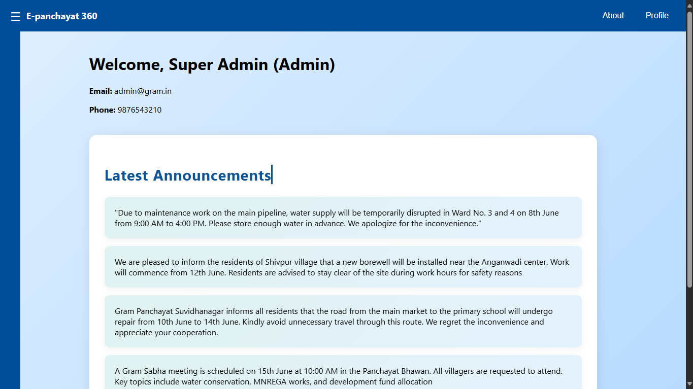

# E Panchayat 360

**E Panchayat 360** is a comprehensive digital solution tailored for modernizing the local governance infrastructure of village panchayats. This platform centralizes public services, governance data, and citizen engagement into a unified web application. Developed with scalability and accessibility in mind, the project empowers administrators and citizens to access services in a streamlined, transparent, and accountable manner.

---

## 👨‍💻 Developed by

**Jison Joseph Sebastian**

---

## 🌟 Features

- 🔐 **Firebase Integration**: Secure authentication and real-time database management using Firebase.
- 📦 **Modular Component Architecture**: Each UI part is built using React components for easy reuse and maintainability.
- 📡 **CORS Configuration**: Ensures secure and controlled communication with APIs.
- 💡 **Utilities and Helpers**: Common functions stored in `utils/` to keep codebase clean.
- 🧪 **Testing Support**: Includes test setup files to ensure component reliability using Jest and React Testing Library.
- 🎨 **Custom Styling**: The application uses modular CSS files for cleaner and isolated styling.
- ⚡ **Performance Monitoring**: Integrated with `reportWebVitals.js` for measuring and optimizing performance.
- 🔄 **Real-time Data Access**: Connects seamlessly to cloud services for data fetch and sync.

---

## 🧾 File Structure

```
E PANCHYAT 360/
├── node_modules/
├── public/
├── src/
│   ├── components/
│   ├── styles/
│   ├── utils/
│   ├── App.css
│   ├── App.js
│   ├── App.test.js
│   ├── cors.json
│   ├── firebase.js
│   ├── index.css
│   ├── index.js
│   ├── logo.svg
│   ├── reportWebVitals.js
│   └── setupTests.js
├── .gitignore
├── package-lock.json
├── package.json
└── README.md
```

---

## 🛠️ Installation & Setup

1. **Clone the Repository**:
   ```bash
   git clone https://github.com/nosij-playz/e-panchayat-360.git
   cd E panchayat 360
   ```

2. **Install Dependencies**:
   ```bash
   npm install
   ```

3. **Configure Firebase**:
   - Fill in your Firebase credentials in `src/firebase.js`

4. **Run the Development Server**:
   ```bash
   npm start
   ```

5. **Run Tests**:
   ```bash
   npm test
   ```

---

## 📸 Screenshots

Below are sample UI screenshots of the E Panchayat 360 application.

<div style="display: grid; grid-template-columns: repeat(auto-fit, minmax(200px, 1fr)); gap: 16px;">





</div>

---

## 🚀 Deployment Options

- Firebase Hosting
- Vercel
- Netlify

---

## 📬 Suggestions & Queries

For suggestions, improvements, or queries regarding the project, kindly reach out through the contact form:  
👉 [Contact Me](https://myporfolio-1o1h.onrender.com/contact)

---

_E Panchayat 360: Bridging governance with technology, one village at a time._
